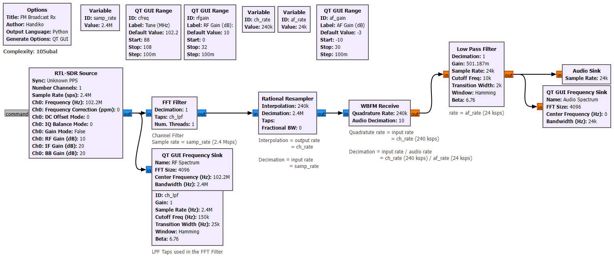
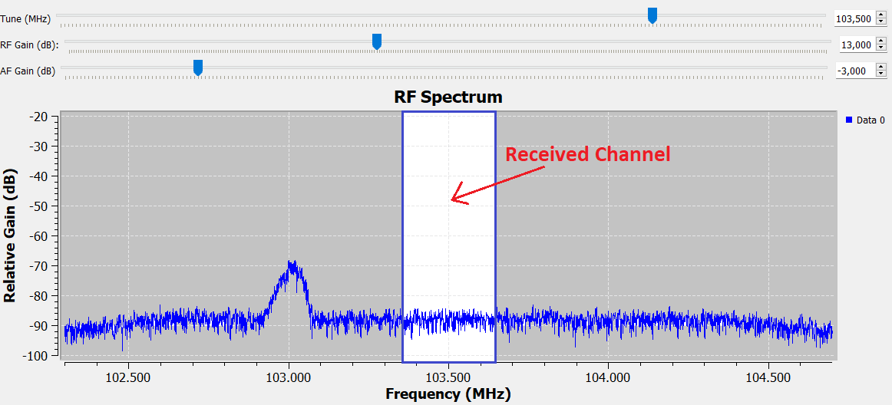
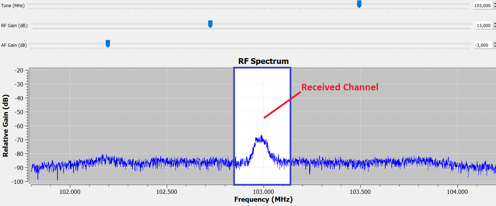
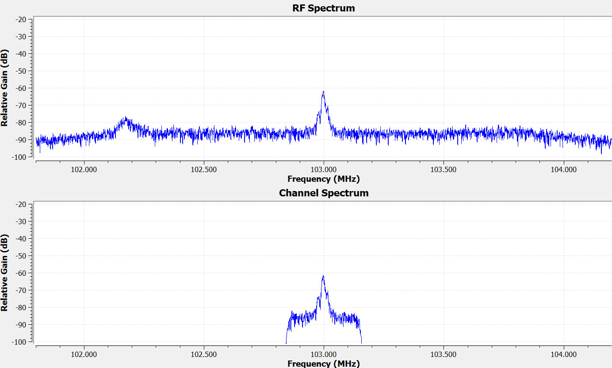
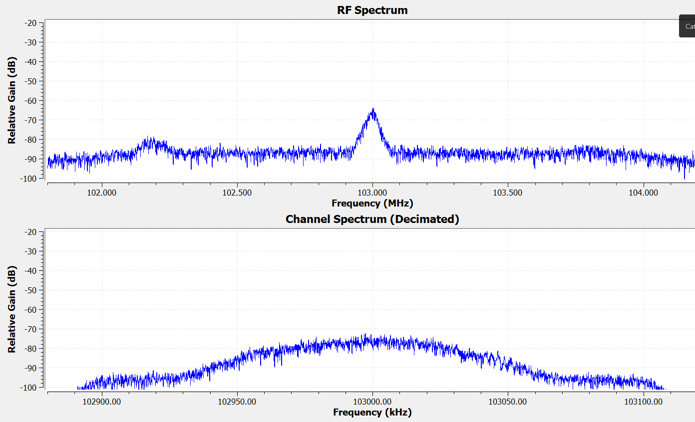

# 📻 RTLSDR FM Broadcast Receiver: A Step-by-Step DSP Tutorial

Building an FM receiver is the quintessential "Hello World" of Software Defined Radio. This project walks you through creating a Wideband FM (WBFM) receiver using **GNU Radio Companion (GRC) 3.10** and an **RTL-SDR** dongle.

Rather than just a "plug-and-play" project, this README serves as a tutorial on how we manipulate raw RF waves into listenable music.

---

## 🎯 The Big Picture
The goal is to capture a slice of the radio spectrum, isolate a specific station, demodulate the frequency changes into audio, and filter out the noise.

### The Full Flowgraph
Here is the complete architecture we will be building:

---

## 🛠 Prerequisites
* **Hardware:** RTL-SDR Dongle (RTL2832U) and an antenna tuned for 88–108 MHz.
* **Software:** * GNU Radio 3.10.x
    * `gr-osmosdr` (The driver block that lets GNU Radio talk to your RTL-SDR).

---

## 🏗 Step-by-Step Breakdown

### 1. Signal Acquisition (The RTL-SDR Source)
The process starts at the **RTL-SDR Source** block. 

* **Sample Rate:** Set to **2.4 Msps** ($2,400,000$ samples per second). 
* **Why?** The RTL-SDR is most stable at this rate. It gives us a $2.4\text{ MHz}$ "window" into the RF spectrum, allowing us to see multiple stations at once.
* **Tuning:** We use a `QT GUI Range` variable to slide our center frequency. 

**Visualizing the Raw Data:**
Before we do anything else, we look at the raw input. This image shows the full $2.4\text{ MHz}$ bandwidth. The "peaks" you see are various local radio stations.

---

### 2. Tuning and Channel Selection
When we "tune" to a station, we are essentially shifting the entire spectrum so that our desired station sits at the **$0\text{ Hz}$ (Baseband)** center point.

To isolate that station, we use an **FFT Filter** (Low Pass Filter):
* **Cutoff:** $150\text{ kHz}$
* **Transition Width:** $25\text{ kHz}$

FM stations are technically $200\text{ kHz}$ wide. We use a slightly wider filter ($240\text{ kHz}$) to ensure we don't "clip" the edges of the music (which causes distortion), while still blocking the neighboring stations.

**The result after filtering:**

---

### 3. Efficiency via Decimation (Rational Resampler)
Our computer doesn't need to process $2.4\text{ million}$ samples per second just to play audio that only requires $24,000$ samples per second. Keeping the rate high would waste CPU power and potentially cause audio stuttering.

We use the **Rational Resampler** to **Decimate** the signal by a factor of 10.
* **Input Rate:** $2.4\text{ MHz}$
* **Decimation:** 10
* **New Rate ($ch\_rate$):** $240\text{ kHz}$

As you can see below, the signal looks the same, but the "X-axis" (the sample rate) has been scaled down significantly.

---

### 4. Demodulation (WBFM Receive)
Up until this point, the data is still **Complex IQ data** (Radio waves). The **WBFM Receive** block performs the mathematical magic of "Quadrature Demodulation." It looks at the *change in frequency* over time and converts that into a *change in voltage* (Audio).

* **Audio Decimation:** We decimate by another factor of 10 here.
* **Final Audio Rate:** $24\text{ kHz}$ (A standard rate that most soundcards can handle easily).

---

### 5. Final Polish & Output
Even after demodulation, there is often high-frequency "hiss" or static. We add a final **Low Pass Filter** with a cutoff of **$10\text{ kHz}$** to clean up the audio.

* **AF Gain:** A simple multiplier that acts as your volume knob.
* **Audio Sink:** This block sends the samples to your speakers.

---

## 🚀 How to Run
1. Plug in your RTL-SDR.
2. Open `rtlsdr_fmrx.grc` in GNU Radio Companion.
3. Click the **Play** icon (or press F6).
4. Use the **Tune** slider to find a station. 
5. Adjust **RF Gain** if the signal is weak, and **AF Gain** for volume.

## 💡 Pro-Tips for Better Reception
* **The Antenna Matters:** A simple "rabbit ear" antenna works best if extended to about $75\text{ cm}$ (the quarter-wavelength for the FM band).
* **Gain Staging:** If you see the "peaks" in your FFT sink hitting the very top of the graph and flattening out, your **RF Gain** is too high (clipping). Turn it down until the signal looks clean.

---
*Tutorial created by [Your Name/GitHub Handle]. Feel free to star this repo if it helped you understand SDR!*
